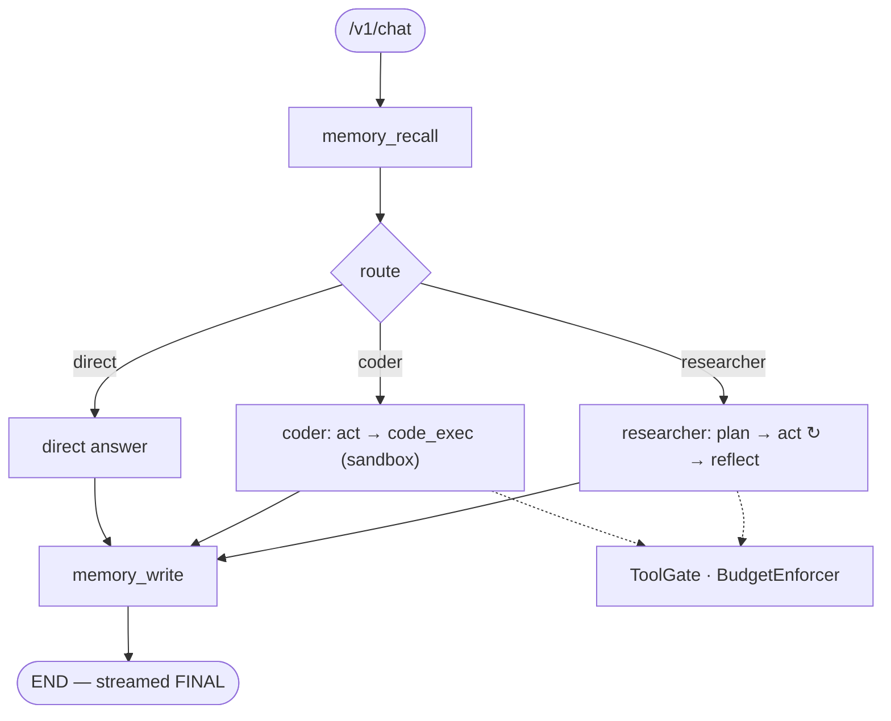

# 🦉 Lour

A production-grade, single-user **multi-agent system**: a LangGraph supervisor
over a **local LLM** (Ollama) with a provider-agnostic path to the cloud, hybrid
RAG, a custom three-layer memory, and an extensible tool system exposed over MCP.

Local-first (everything runs on a Mac), cloud-ready (swap in a reliability tier
by changing one env var), observable by default (structlog baseline + Langfuse).

> Reference hardware: MacBook M4, 24 GB unified memory, `qwen3:14b`. Configurable
> for other hardware via `.env` — see [PROJECT_CONTEXT](PROJECT_CONTEXT_2.0.md) §3.3.

## What it does

- **Free-form chat** (`/v1/chat`) routed by a LangGraph **supervisor** to a
  `researcher` or `coder` sub-agent, or answered directly — streamed as SSE with
  live node/tool progress.
- **Skills** (`/v1/skills`) — declarative, high-level scenarios
  (`research_topic`, `review_code`, `answer_from_kb`, `summarize_document`) with
  per-skill policy and auto-routing.
- **Hybrid RAG** — dense (bge-m3) + sparse (BM42) + cross-encoder rerank over
  your personal corpus.
- **Three-layer memory** — short-term (Redis), long-term (Qdrant, with
  importance + decay), episodic (Postgres), consolidated in the background.
- **Tools + sandbox + MCP** — a tool registry with an allowlist gate, an
  isolated Docker code sandbox, and bidirectional MCP (consume and expose tools).
- **HITL** — side-effecting tools pause for human approval and resume from a
  Postgres checkpoint.

## Architecture at a glance



Six code layers (Gateway → Skills → Orchestration → Tools → Services →
Infrastructure) over attached backing services. Full write-up:
[`docs/architecture.md`](docs/architecture.md); diagrams in
[`docs/diagrams/`](docs/diagrams/); the twelve decisions in
[`docs/adr/`](docs/adr/).

## Quickstart (~5 minutes)

**Prerequisites:** [Docker](https://www.docker.com/),
[Ollama](https://ollama.com/) running natively on the host, and
[`uv`](https://docs.astral.sh/uv/). On a Mac, Ollama is *not* in Compose — it
runs on the host and is reached via `host.docker.internal`.

```bash
# 1. Configure (the defaults target an M4 24 GB / Split profile)
cp .env.example .env

# 2. Pull the models (qwen3:14b + bge-m3) and install deps
make pull-models
make install

# 3. Start Postgres, Redis, Qdrant (Ollama stays on the host)
make up

# 4. Apply migrations and launch the API
make migrate
make dev                       # → http://localhost:8000  (docs at /docs)
```

Then, in a second terminal, exercise the whole stack end-to-end:

```bash
python scripts/seed_rag.py     # (optional) seed the sample RAG corpus
make demo                      # scripted run: skills + a streamed chat turn
```

Prefer a UI? Launch the minimal Streamlit client (installs on demand):

```bash
uv sync --extra ui
make ui                        # → Streamlit chat rendering live SSE node events
```

> The demo and UI authenticate with the API key from `.env` (`APP_API_KEY`,
> default `changeme-user`), sent as `X-API-Key`. Override the endpoint/key in the
> Streamlit sidebar or via `LOUR_BASE_URL` / `APP_API_KEY`.

## Everyday commands

```
make up / down / logs / ps     # docker compose (mac profile by default)
make dev                       # uvicorn with reload on :8000
make demo                      # scripted end-to-end demo
make ui                        # Streamlit demo client (needs: uv sync --extra ui)
make lint / fmt                # ruff + mypy strict / autofix
make test / test-unit          # pytest
make eval                      # full eval suite (RAG + agents + routing)
make migrate                   # alembic upgrade head
```

## Configuration & topology

Every backing service (LLM, DB, cache, vector store, reranker, observability) is
an attached resource addressed from `.env`. Three deployment profiles
(Solo / Split / Offloaded) move services between the Mac and the cloud without
code changes. Switch the LLM tier with `LLM_PROVIDER=ollama|anthropic|openai`.
See [`.env.example`](.env.example) for the annotated reference config.

## Extending

New tools, skills, providers and MCP servers plug in declaratively — see
[`docs/extending.md`](docs/extending.md).

## Project status

Phases 0–8 complete (MVP, `v1.0.0`): infra, LLM service, RAG, tools + MCP,
memory, orchestration, skills, gateway hardening, eval + observability. Phase 9
(this): demo UI, docs and quickstart polish.
